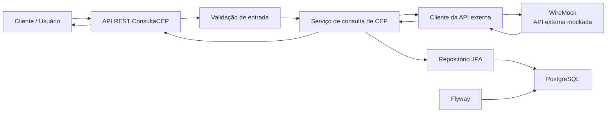
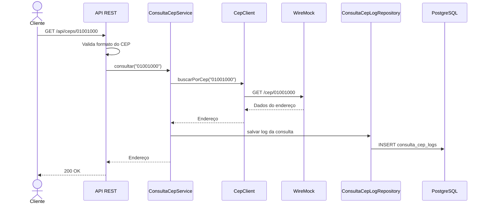

# Arquitetura da solução

## Visão geral

A ConsultaCEP é uma aplicação REST em Java com Spring Boot responsável por consultar dados de endereço a partir de um CEP, consumir uma API externa mockada com WireMock e registrar cada consulta em uma base PostgreSQL.

A aplicação Java roda localmente. O Docker Compose é usado apenas para subir os serviços externos necessários ao desenvolvimento: PostgreSQL e WireMock.

## Objetivos da solução

* Consultar informações de endereço por CEP.
* Consumir uma API externa mockada.
* Registrar os logs das consultas realizadas.
* Armazenar horário da consulta e dados retornados pela API externa.
* Manter uma organização simples, testável e aderente a conceitos básicos de SOLID.
* Disponibilizar um desenho claro da solução para apresentação técnica.

## Desenho da solução



## Componentes

### Aplicação Java

Responsável por expor a API REST, validar o CEP recebido, coordenar a consulta externa, persistir o log da consulta e devolver a resposta ao cliente.

### WireMock

Simula a API externa de CEP. Ele permite controlar cenários de sucesso e erro sem depender de uma API real durante o desenvolvimento e a apresentação.

Cenários mockados inicialmente:

* CEP encontrado: `GET /cep/01001000` retorna `200`.
* CEP não encontrado: `GET /cep/{cep com 8 dígitos}` retorna `404` quando não existe um mock específico.
* CEP inválido: `GET /cep/{valor fora do padrão}` retorna `400`.

### PostgreSQL

Banco relacional usado para persistir os logs das consultas de CEP.

### Flyway

Responsável pelo versionamento do banco de dados. A estrutura inicial é criada via migration.

## Contrato da API da aplicação

### Consultar CEP

Endpoint previsto:

```http
GET /api/ceps/{cep}
```

Resposta de sucesso prevista:

```json
{
  "cep": "01001000",
  "logradouro": "Praça da Sé",
  "bairro": "Sé",
  "localidade": "São Paulo",
  "uf": "SP"
}
```

Comportamentos esperados:

* `200 OK`: CEP encontrado.
* `400 Bad Request`: CEP com formato inválido.
* `404 Not Found`: CEP não encontrado na API externa.
* `500 Internal Server Error`: erro inesperado na aplicação ou indisponibilidade externa não tratada.

### Consultar histórico

Endpoint previsto:

```http
GET /api/consultas
```

Filtros opcionais:

```http
GET /api/consultas?cep=01001000
GET /api/consultas?success=true
GET /api/consultas?success=false
GET /api/consultas?inicio=2026-07-02T00:00:00&fim=2026-07-02T23:59:59
GET /api/consultas?success=false&inicio=2026-07-02T00:00:00&fim=2026-07-02T23:59:59
GET /api/consultas?page=0&size=10
```

Resposta prevista:

```json
{
  "content": [
    {
      "id": 1,
      "cep": "01001000",
      "logradouro": "Praça da Sé",
      "bairro": "Sé",
      "localidade": "São Paulo",
      "uf": "SP",
      "httpStatusCode": 200,
      "success": true,
      "responseBody": "{\"cep\":\"01001000\",\"logradouro\":\"Praça da Sé\",\"bairro\":\"Sé\",\"localidade\":\"São Paulo\",\"uf\":\"SP\"}",
      "errorMessage": null,
      "consultedAt": "2026-07-02T19:30:00"
    }
  ],
  "page": 0,
  "size": 10,
  "totalElements": 1,
  "totalPages": 1
}
```

Comportamentos esperados:

* Sem filtros: retorna todos os logs, ordenados da consulta mais recente para a mais antiga.
* `success=true`: retorna apenas consultas concluídas com sucesso.
* `success=false`: retorna apenas tentativas com erro retornado pela API externa.
* `cep`: filtra por um CEP específico.
* `inicio` e `fim`: filtram por intervalo de data/hora da consulta.
* `page`: número da página, começando em `0`.
* `size`: quantidade de registros por página, entre `1` e `100`.

## Contrato da API externa mockada

Base local do WireMock:

```text
http://localhost:8081
```

### CEP encontrado

```http
GET /cep/01001000
```

```json
{
  "cep": "01001000",
  "logradouro": "Praça da Sé",
  "bairro": "Sé",
  "localidade": "São Paulo",
  "uf": "SP"
}
```

### CEP não encontrado

```http
GET /cep/99999999
```

```json
{
  "erro": "CEP nao encontrado"
}
```

### CEP inválido

```http
GET /cep/abc
```

```json
{
  "erro": "CEP invalido"
}
```

## Modelo de dados

Tabela: `consulta_cep_logs`

| Campo | Tipo | Descrição |
| --- | --- | --- |
| `id` | `BIGSERIAL` | Identificador do log |
| `cep` | `VARCHAR(8)` | CEP consultado |
| `logradouro` | `VARCHAR(255)` | Logradouro retornado pela API externa |
| `bairro` | `VARCHAR(255)` | Bairro retornado pela API externa |
| `localidade` | `VARCHAR(255)` | Cidade/localidade retornada pela API externa |
| `uf` | `VARCHAR(2)` | Unidade federativa retornada pela API externa |
| `response_body` | `TEXT` | Resposta completa retornada pela API externa |
| `http_status_code` | `SMALLINT` | Status HTTP retornado pela API externa ou status técnico da integração |
| `success` | `BOOLEAN` | Indica se a consulta externa retornou sucesso |
| `error_message` | `VARCHAR(255)` | Mensagem de erro quando a consulta externa falha |
| `consulted_at` | `TIMESTAMP` | Data e hora em que a consulta foi realizada |

## Fluxo principal



## Organização de pacotes prevista

```text
desafio.santander.springboot
├── config
├── cep
│   ├── client
│   ├── controller
│   ├── domain
│   ├── dto
│   ├── exception
│   ├── repository
│   └── service
└── SpringbootApplication.java
```

Responsabilidades:

* `config`: configurações da aplicação, OpenAPI, clientes HTTP e propriedades.
* `client`: integração com a API externa de CEP.
* `controller`: entrada HTTP da aplicação.
* `domain`: entidades e objetos de domínio.
* `dto`: contratos de entrada e saída da API.
* `exception`: tratamento de erros e respostas padronizadas.
* `repository`: acesso ao banco de dados.
* `service`: regras de negócio e orquestração do caso de uso.

## Aplicação dos conceitos de SOLID

* Responsabilidade única: controller, service, client e repository terão papéis separados.
* Aberto/fechado: a integração externa poderá ser trocada por outra implementação sem alterar o serviço principal.
* Substituição de Liskov: contratos de integração poderão ter implementações equivalentes.
* Segregação de interfaces: interfaces pequenas para casos de uso e clientes externos.
* Inversão de dependência: o serviço dependerá de abstrações, não diretamente de detalhes de HTTP ou banco.

## Ambiente local

Serviços externos:

```text
PostgreSQL: localhost:55432
WireMock:   localhost:8081
```

O arquivo `.env` guarda as variáveis locais. O arquivo `.env.exemplo` serve como modelo.

Comandos principais:

```bash
docker compose up -d
./mvnw test
./mvnw spring-boot:run
```

No Windows:

```powershell
docker compose up -d
.\mvnw.cmd test
.\mvnw.cmd spring-boot:run
```
